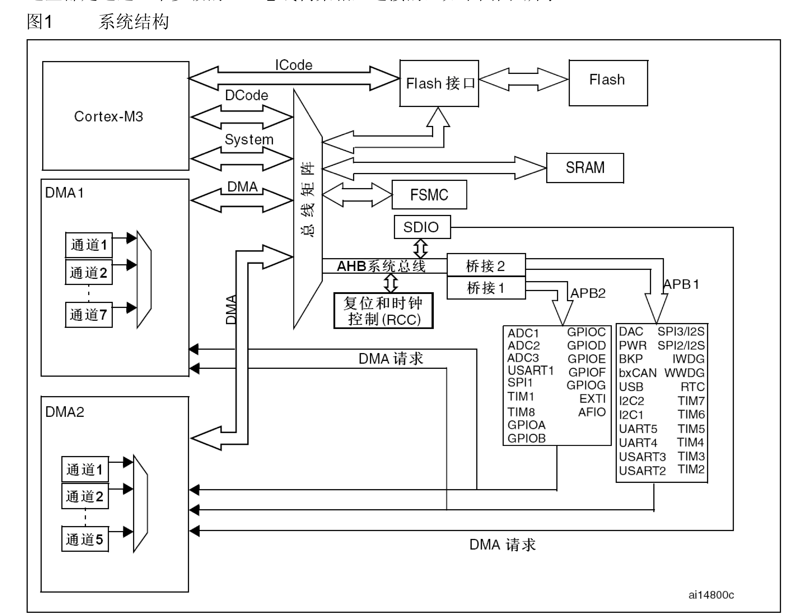
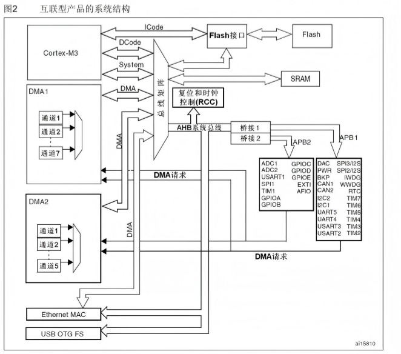

> 上一篇：[STM32学习笔记(一)：那些你该知道的事儿](/docs/stm32/STM32知识库/STM32学习笔记一-那些你该知道的事儿)

---

> 本节主要学习STM32的底层硬件组织方式，包括：  
> **存储器映像、位带操作、启动模式、电源管理、复位机制、时钟树与 RCC寄存器**。  
> 这些内容是后续学习**GPIO、定时器、中断、串口、外设驱动** 的基础。

---

#  本章学习目标

学完这一章，应该能搞清楚下面几个问题：

- STM32的 **4GB 地址空间** 是怎么划分的？
- 为什么 STM32要有**位带操作**？
- STM32上电后到底是从哪里开始执行程序的？
- **ISP 和IAP**分别是什么？
- STM32的低功耗模式有哪些，有什么区别？
- STM32的时钟系统为什么这么复杂？
- RCC里哪些寄存器是开发中最常用的？
---

# 1 STM32 总线架构

<p align="center">
  
</p>

在小容量、中容量和 大容量产品中，主系统由以下部分构成：
● 四个驱动单元：
-  Cortex™-M3内核DCode总线(D-bus)，和系统总线(S-bus) 
- 通用DMA1和通用DMA2 

● 四个被动单元
- 内部SRAM 
- 内部闪存存储器
- FSMC 
- AHB到APB的桥(AHB2APBx)，它连接所有的APB设备
这些都是通过一个多级的AHB总线构架相互连接的，如上图所示
---
在互联型产品中，主系统由以下部分构成：
● 五个驱动单元：
- Cortex™-M3内核DCode总线(D-bus)，和系统总线(S-bus) 
- 通用DMA1和通用DMA2 
- 以太网DMA 

● 三个被动单元
- 内部SRAM 
- 内部闪存存储器
- AHB到APB的桥(AHB2APBx)，它连接所有的APB设备
这些都是通过一个多级的AHB总线构架相互连接的，如下图所示
<p align="center">
  
</p>

---
# 2. STM32 的存储器映像

## 2.1 什么是存储器映像

STM32 是 32 位单片机，地址总线通常按 **32 位地址空间** 来理解，因此理论上可以访问：

2^32 Byte = 4 GB

但实际芯片内部当然不可能真的有 4GB 存储器，所以 STM32 采用的是：

> **逻辑地址空间统一规划，实际硬件资源按区域映射到对应地址。**

这就是所谓的：

> **存储器映像（Memory Map）**

它的本质是：  
**告诉 CPU：不同地址范围分别对应哪一类硬件资源。**

---

## 2.2 STM32 的统一编址

STM32（ARM Cortex-M）采用的是：

> **内存与 IO 统一编址**

也就是说：

- RAM 是通过地址访问的
- Flash 是通过地址访问的
- 外设寄存器也是通过地址访问的

所以我们平时写寄存器，本质上就是在访问某个地址上的内容。

例如：
```C
*(volatile unsigned int *)0x40021018 = 0x00000010;
```


本质上就是在操作某个外设寄存器。

---

## 2.3 STM32 地址空间的理解

学习 STM32 时，不需要死记整个 4GB 地址表，但必须建立下面这个认知：

> **STM32 所有资源，本质上都是“映射到地址上的”。**

后面你会频繁接触：

- Flash
- SRAM
- 外设寄存器
- 系统存储区
- Boot 启动区
- RCC / GPIO / USART / TIM 等寄存器地址

所以“地址意识”非常重要。

---

## 2.4 常见存储区域（入门重点）

课程中提到的几个典型区域如下：
```

0x00000000 - 0x07FFFFFF    映射区  
0x08000000 - 0x0801FFFF    Flash  
0x1FFFF000 - 0x1FFFF800    System Memory  
0x1FFFF800 - 0x1FFFF9FF    Option Bytes

```
可以先这样理解：

### （1）Flash（用户闪存）

0x08000000 开始

这是最重要的区域之一。

作用：

- 存放用户程序代码
- 平时下载进去的程序，默认就在这里
- STM32 正常运行时，通常就是从这里启动

你以后最常见的“程序烧录”本质上就是：

> 把 `.bin / .hex` 文件写入 Flash

---

### （2）System Memory（系统存储器）

这个区域通常是芯片厂家预先写好的内容。

主要作用：

- 存放官方 BootLoader
- 用于串口 / USB 等方式下载程序
- 是 **ISP** 功能的重要基础

也就是说：

> 当 STM32 从 System Memory 启动时，它执行的不是你写的程序，而是芯片内部自带的启动程序。

---

### （3）Option Bytes（选项字节）

这个区域主要用于保存一些特殊配置，例如：

- 读保护
- 写保护
- 看门狗配置
- 启动相关配置

这个区域平时不常直接操作，但它在量产、保护和启动控制中很重要。

---

# 3. 位带操作（Bit-Band）

## 3.1 为什么需要位操作

STM32 编程中，我们经常需要控制某一个单独的位，例如：

- 设置某个 GPIO 输出高电平
- 清除某个中断标志位
- 打开某个时钟使能位

例如：
```c
RCC->APB2ENR |= (1 << 2);
```

这就是在设置某一个 bit。

但问题是：

> STM32 并不直接支持“对单独 1 位进行真正硬件级访问”。

通常的位操作流程其实是：

1. 先把整个寄存器读出来
2. 修改其中某一位
3. 再整体写回去

这叫：

> **读-改-写（Read-Modify-Write）**

虽然能实现，但会有两个问题：

- **效率不高**
- 某些场景下可能带来 **并发问题**

---

## 3.2 位带操作的核心思想

ARM 为了解决“单 bit 操作不方便”的问题，引入了：

> **位带（Bit-Band）机制**

它的本质思想不是“真的直接访问这一位”，而是：

> **把某一位映射到另一个特殊地址上，用访问这个地址的方式，间接完成对这一位的操作。**

也就是说：

- 原来的某一位（bit）
- 会被映射成别名区里的一个“字（32位）”
- 你只要对这个“别名地址”写 0 或 1
- 就相当于在操作原地址中的那一位

---

## 3.3 位带的关键结论

课程中提到的重点是：

> **别名区大小 = 位带区大小 × 32**

因为：

- 位带区里每 1 位
- 在别名区中都对应 1 个 32 位字

所以别名区会大很多。

---

## 3.4 学习建议

位带操作**原理要理解**，但前期不建议死磕地址公式。  
你只需要先建立下面这个意识：

> **位带 = “把 bit 当成可单独访问对象”的一种地址映射技巧**

后面在写：

- GPIO 快速控制
- 寄存器封装
- 裸机驱动

就会逐渐理解它的价值。

---

# 4. STM32 的启动模式

---

STM32 常见有三种启动来源：

### （1）从用户 Flash 启动（最常用）

这是正常开发最常见的模式。

特点：

- 执行你自己写的程序
- 程序一般烧录在 Flash 中
- 单片机正常工作时通常使用这种模式

你可以理解成：

> **“正式运行模式”**

---

### （2）从 System Memory 启动

这种模式下，STM32 会执行芯片内部自带的系统程序。

主要用途：

- 串口下载程序
- USB 下载程序
- 使用官方 BootLoader
- 实现 ISP

你可以理解成：

> **“进入官方下载模式”**

---

### （3）从 SRAM 启动

这种模式相对少见，主要用于：

- 调试
- 特殊实验
- 某些开发测试场景

你可以理解成：

> **“临时从 RAM 跑程序”**

一般正常项目开发中不常作为主流方案。

---

# 5. ISP 和 IAP

这是 STM32 启动模式里非常实用的一部分。

---

## 5.1 什么是 ISP

ISP = **In-System Programming**

中文通常理解为：

> **在系统编程 / 在板下载**

它解决的问题是：

> **不拆芯片、不用专用烧录器，也能把程序写进单片机内部 Flash。**

例如：

- PC 通过串口
- 向 STM32 发送 `.bin / .hex`
- STM32 通过内部 BootLoader 写入 Flash

这就是典型的 ISP 思路。

---

## 5.2 什么是 IAP

IAP = **In-Application Programming**

中文通常理解为：

> **在应用编程 / 在线升级**

它和 ISP 的本质区别在于：

> **IAP 是你自己写升级程序，而不是依赖官方系统 BootLoader。**

IAP 的核心流程一般是：

1. 用户程序运行中
2. 通过串口 / USB / 网口等接收新固件
3. 程序自己操作 Flash 控制器
4. 把新程序写入指定区域
5. 重启后运行新程序

---

## 5.3 IAP 的典型结构

IAP 项目通常会把 Flash 分成两部分：

BootLoader + App

### BootLoader

负责：

- 接收升级文件
- 擦写 Flash
- 跳转到 App

### App

负责：

- 正常业务逻辑
- 真正的产品功能

这就是很多嵌入式产品“在线升级”的基础架构。

---

## 5.4 ISP 和 IAP 的区别（非常重要）

|对比项|ISP|IAP|
|---|---|---|
|程序执行者|官方系统 BootLoader|用户自己写的 BootLoader / 应用程序|
|是否依赖系统存储区|是|不一定|
|使用场景|下载程序、恢复程序|产品在线升级|
|灵活性|一般|很高|
|项目实用性|入门常见|工程中更常见|

---

# 6. STM32 的电源管理系统

STM32 除了“能跑”，还讲究“怎么省电”。

所以芯片提供了多种低功耗模式。

---

## 6.1 为什么需要低功耗

很多嵌入式设备不是一直高性能运行的，例如：

- 电池供电设备
- 传感器节点
- 便携仪器
- 低功耗控制板

很多时候 MCU 的工作方式其实是：

醒一下 → 干活 → 再睡

所以 STM32 提供了多种“睡眠深度”。

---

## 6.2 STM32 常见低功耗模式

STM32 常见的三种低功耗模式是：

1. **Sleep（睡眠模式）**
2. **Stop（停机模式）**
3. **Standby（待机模式）**

它们的区别本质上就是：

> **“停掉多少模块，保留多少运行状态”**
---

## 6.3 Sleep（睡眠模式）

特点：

- **CPU 停止**
- **外设仍可运行**
- 时钟通常还在工作

适合场景：

- 暂时不需要 CPU 运算
- 但外设还需要继续工作

例如：

- 串口接收等待
- 定时器仍在计时
- 中断唤醒 CPU

### 唤醒方式

> 一般可由 **中断** 唤醒

这是最轻量的省电模式。

---

## 6.4 Stop（停机模式）

特点：

- **CPU 停**
- **主时钟停**
- **大部分外设停**
- **SRAM 和寄存器内容保持**

这是比 Sleep 更深一级的低功耗模式。

适合场景：

- 系统长时间待机
- 但还希望“醒来后继续接着运行”

### 优点

- 功耗更低
- 内存数据还在

### 唤醒方式

> 通常依赖 **外部中断** 等方式唤醒

你可以把它理解为：

> **“暂停运行，但保留现场”**

---

## 6.5 Standby（待机模式）

特点：

- CPU 停
- 外设停
- 时钟停
- SRAM / 大部分寄存器内容丢失
- 只有少量备份区域和待机电路保留

它已经非常接近：

> **“关机”**

### 唤醒方式

常见包括：

- WKUP 引脚
- RTC 闹钟
- NRST 复位
- IWDG 看门狗复位

### 特点总结

这是功耗最低的模式之一，但代价是：

> **醒来后通常相当于“重新开机”**

---

## 6.6 三种低功耗模式对比

|模式|CPU|时钟|外设|SRAM数据|唤醒后状态|
|---|---|---|---|---|---|
|Sleep|停|保持|多数可运行|保持|继续运行|
|Stop|停|停|多数停止|保持|继续运行|
|Standby|停|停|停|大多丢失|类似重新启动|

---

# 7. 复位与时钟概述

STM32 的“能运行”离不开两个底层条件：

- **复位**
- **时钟**

你可以把它们理解为：

- **复位**：让系统回到“起跑线”
- **时钟**：让系统“动起来”

---

## 7.1 STM32 的复位设计

复位的本质作用是：

> **把 CPU 和关键硬件重新拉回初始状态**

当 STM32 被复位后：

- 程序计数器会回到复位向量
- CPU 从固定入口重新开始执行程序

所以：

> **“上电后程序从哪里开始跑” 和 “复位后程序从哪里重新跑” 本质上是同一套逻辑。**

---

## 7.2 为什么 STM32 时钟系统很重要

STM32 的时钟不是“单一时钟”，而是一个复杂的：

> **时钟树（Clock Tree）**

因为不同模块对时钟的需求不同，例如：

- CPU 要跑主频
- 定时器要计时
- 串口要波特率
- ADC 要采样时钟
- RTC 要低速稳定时钟
- USB 要固定频率时钟

所以 STM32 必须设计一整套：

- 时钟源
- 倍频
- 分频
- 分配
- 开关控制

这就是 RCC 的核心职责。

---

# 8. STM32 时钟系统核心认识

---

<p align="center">
  
</p>

## 8.1 STM32 的时钟源

STM32 常见有两大类时钟源：

### 高速时钟（HSx）

- **HSI**：高速内部时钟
- **HSE**：高速外部时钟

### 低速时钟（LSx）

- **LSI**：低速内部时钟
- **LSE**：低速外部时钟

可以先这样理解：

- **内部时钟**：芯片自己产生，方便、成本低
- **外部时钟**：通常更稳定、更适合精确应用

---

## 8.2 内部时钟与外部时钟

### 内部时钟

优点：

- 不需要外部晶振
- 上电即可使用
- 成本低，设计简单

缺点：

- 精度一般不如外部晶振

---

### 外部时钟

优点：

- 精度高
- 稳定性好
- 适合 USB、RTC、通信等精度要求较高的场景

缺点：

- 需要额外硬件
- 电路更复杂一点

---

# 9. PLL（锁相环）——倍频器

STM32 中非常重要的一个模块是：

> **PLL（Phase Locked Loop，锁相环）**

它最常见的用途可以简单理解为：

> **把较低频率的时钟“放大”成更高频率。**

例如：

8MHz → 倍频 → 72MHz

这样 STM32 就能跑到更高主频。

---

## 9.1 为什么需要 PLL

因为外部晶振或内部时钟源频率往往有限，不能直接满足 MCU 高速运行需求。

所以一般流程是：

时钟源 → PLL 倍频 → 系统主时钟

这是 STM32 很常见的配置思路。

---

# 10. STM32 时钟树的核心节点

学习 STM32 时钟时，最重要的不是死记框图，而是搞清楚几个“关键节点”。

课程中提到的关键时钟名称如下：

HSI、HSE、LSI、LSE  
PLLCLK、SYSCLK  
USBCLK、HCLK、FCLK、PCLK1、PCLK2、ADCCLK、RTCCLK、IWDGCLK

下面按“开发最常用理解”整理。

---

## 10.1 SYSCLK（系统时钟）

这是 STM32 的：

> **主系统时钟**

可以理解成：

> **整个系统最核心的时钟输入**

它通常来自：

- HSI（I表示internal，内部时钟）
- HSE（E表示external，外部时钟）
- PLL 输出

开发里最常见的是：

HSE → PLL → SYSCLK

---

## 10.2 HCLK（AHB 总线时钟）

HCLK 是系统总线层的重要时钟，很多模块会依赖它。

你可以先简单理解为：

> **CPU / 总线相关的重要工作时钟**

---

## 10.3 PCLK1 / PCLK2（APB 外设时钟）

STM32 会把外设分到不同总线上，所以有：

- **PCLK1**
- **PCLK2**

它们主要负责：

> **给外设提供工作时钟**

例如：

- USART
- SPI
- TIM
- ADC
- GPIO
- AFIO

很多外设“不工作”，本质上不是代码错了，而是：

> **你根本没给它开时钟**

这是 STM32 初学最容易踩的坑之一。

---

## 10.4 RTCCLK / IWDGCLK

这两个时钟通常服务于特殊模块：

- **RTCCLK**：RTC 实时时钟
- **IWDGCLK**：独立看门狗时钟

说明 STM32 的时钟系统是：

> **多个模块各自有独立时钟需求**

这也是“时钟树复杂”的根本原因。

---

# 11. SysTick 与 MCO

---

## 11.1 SysTick

SysTick 是 Cortex-M 内核自带的一个系统定时器。

它非常重要，因为后面你会经常用它做：

- 毫秒延时
- 系统节拍
- RTOS 心跳
- 周期性任务调度

可以把它理解成：

> **单片机内部的“系统时钟节拍器”**

---

## 11.2 MCO

MCO（Microcontroller Clock Output）可以把某些时钟输出到引脚上。

它的作用主要是：

- 调试时钟是否正确
- 观察某个时钟源是否工作
- 用示波器测量频率

属于比较实用的“调试辅助功能”。

---

# 12. RCC：时钟控制核心模块

STM32 的时钟系统，最终都是通过：

> **RCC（Reset and Clock Control）**

来控制的。

RCC 负责两件大事：

- **Reset（复位）**
- **Clock（时钟）**

所以你以后写外设驱动时，第一步几乎总是：

> **先开时钟**

---

# 13. RCC 常用寄存器整理

课程中提到的常见 RCC 寄存器如下：

RCC_CR  
RCC_CFGR  
RCC_CIR  
RCC_APB2RSTR  
RCC_APB1RSTR  
RCC_AHBENR  
RCC_APB2ENR  
RCC_APB1ENR  
RCC_BDCR  
RCC_CSR

这里按实际开发优先级整理了一下。

---

## 13.1 RCC_CR —— 时钟开关控制（重要）

作用：

- 控制 HSI / HSE / PLL 的开关
- 判断它们是否稳定

常见理解：

- **开时钟源**
- **看时钟源是否准备好**

它是“时钟源层”的核心寄存器。

---

## 13.2 RCC_CFGR —— 时钟配置（重要）

作用：

- 选择系统时钟来源（一般用外部高精度时钟）
- 配置 PLL
- 设置 AHB / APB 分频
- 配置 ADC / MCO 等时钟相关参数

可以理解为：

> **“时钟路线图配置中心”**

它是学习 STM32 时钟树时必须重点理解的寄存器。

---

## 13.3 RCC_AHBENR / RCC_APB2ENR / RCC_APB1ENR（非常重要）

这是开发中最常写的一类寄存器。

作用：

> **给外设开时钟**

例如：

- GPIO
- USART
- SPI
- TIM
- ADC

你几乎所有外设初始化的第一步都离不开它。

比如经典代码：
```c
RCC->APB2ENR |= (1 << 2);
```


这类代码本质上就是：

> **给某个外设“通电上班”**

如果你不做这一步，后面配置寄存器通常都不会生效。

---

## 13.4 RCC_APB2RSTR / RCC_APB1RSTR

作用：

> **复位外设**

当某个外设状态异常时，可以通过这些寄存器对外设进行“硬件级重新初始化”。

你可以把它理解成：

> **给某个外设单独“重启”**

---

## 13.5 RCC_BDCR / RCC_CSR

这两个寄存器通常和下面这些内容有关：

- 备份域
- RTC
- 低速时钟
- 复位标志
- 看门狗相关状态

前期了解即可，后面做 RTC / 低功耗 / 看门狗时会更常接触。

---

# 14. 寄存器位的三种常见类型

课程中总结得很实用：

> 寄存器位一般有三种：

---

## 14.1 状态位

特点：

- 反映当前硬件状态
- 一般是“读”为主

例如：

- 时钟是否稳定
- 中断是否发生
- 外设是否忙

---

## 14.2 开关位

特点：

- 控制模块开 / 关
- 一般写 0 / 1

例如：

- 时钟使能
- 模块使能
- 复位使能

---

## 14.3 设置值位

特点：

- 用来配置参数
- 通常不止 1 位

例如：

- 分频系数
- 模式选择
- 时钟源选择
- 波特率参数

---

# 15. 本章学习中的核心理解（最值得记住的部分）

如果只保留这一章最关键的认知，我会总结成下面 8 句话：

##  存储器映像

> STM32 的所有资源，本质上都是“映射到地址上的”。

---

## 外设寄存器

> 配置外设，本质上就是在读写对应地址上的寄存器。

---

##  位带操作

> 位带是 ARM 为了更方便控制“单独某一位”而设计的一种地址映射机制。

---

##  启动模式

> 启动模式决定了 STM32 上电后“从哪里开始执行程序”。

---

##  ISP 和 IAP

> ISP 依赖系统 BootLoader；IAP 是用户自己实现升级机制。

---

##  低功耗模式

> STM32 的省电本质是：根据需求让 CPU / 时钟 / 外设“分级休眠”。

---

## 时钟系统

> STM32 不是“一个时钟”，而是“一棵时钟树”。

---

##  RCC

> 几乎所有外设开发的第一步，都是先通过 RCC 开时钟（时钟就是单片机心脏）。

---

# 16. 开发实践建议（很重要）

学习这一章时，最容易陷入一个误区：

> **只记概念，不结合代码。**

更好的学习方式是：

---

## 建议 1：一边看时钟树，一边看代码

例如你以后写 GPIO 初始化时：

```c
RCC->APB2ENR |= (1 << 2);
```

这时候就去问自己：

- 我为什么要开 APB2？
- GPIOA 为什么挂在 APB2 上？
- 如果不开时钟会怎样？

这样“概念”才会真正落地。

---

## 建议 2：学会看“寄存器 + 地址 + 位”

STM32 的底层开发能力，本质上就是：

> **能不能把“外设功能”翻译成“寄存器位操作”。**

所以这章虽然偏底层，但它其实非常关键。

---

## 建议 3：这一章不用死背，重在形成框架

这一章不要求你一次性全部记牢，重点是建立一套框架：
```
存储器 → 启动 → 电源 → 复位 → 时钟 → RCC
```
* 后面随着GPIO、USART、TIM、ADC的学习，这些知识会反复出现。

---

# 17. 本章总结

这一章本质上是在回答一个问题：

> **STM32 这颗芯片，底层到底是怎么组织起来并运行的？**

你可以把它看成是在认识 STM32 的“硬件骨架”：

- 存储器决定“资源放在哪里”
- 启动模式决定“程序从哪里跑”
- 电源管理决定“芯片怎么省电”
- 复位决定“系统怎么回到初始状态”
- 时钟系统决定“整个芯片怎么运转起来”
- RCC 决定“这些东西怎么被控制”

所以这一章虽然不像 GPIO 点灯那样“直观”，但它非常重要。

> **真正会 STM32，不只是会调库函数，而是逐渐理解它底层为什么这样设计。**